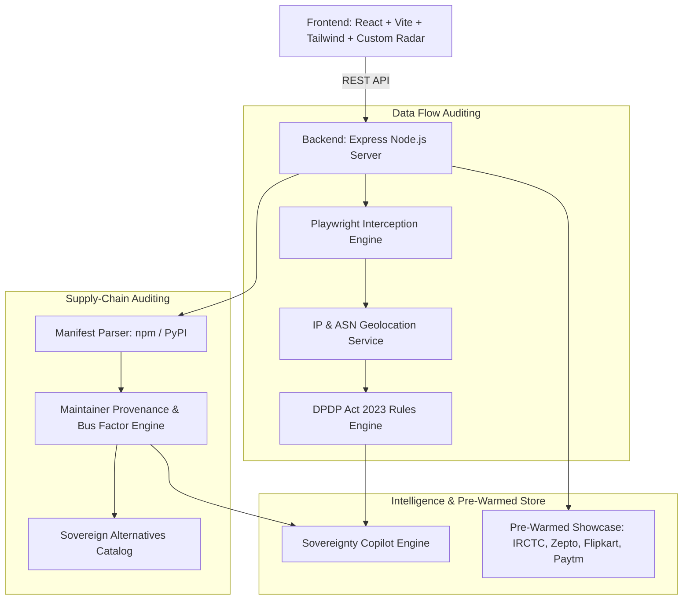

# SovereignStack: Digital Sovereignty & Supply-Chain Auditor

[](https://opensource.org/licenses/MIT)
[](https://www.meity.gov.in)
[](#architecture)

> **Where does Indian user data actually flow — and who really controls the code running your digital life?**

SovereignStack is an automated digital sovereignty audit platform engineered to inspect, map, and score cross-border data egress flows and software supply-chain dependencies against Indian national data protection standards (**DPDP Act 2023**).

---

## 🎯 The Problem

1. **Invisible Cross-Border Egress**: When an Indian citizen uses an e-commerce, banking, or government website, background trackers, ad beacons, and CDNs silently exfiltrate browsing telemetry and device fingerprints to overseas servers subject to foreign surveillance mandates (e.g., US CLOUD Act).
2. **Software Supply-Chain Takeover Hazards**: Modern software applications pull hundreds of transitive third-party dependencies. Attacks like `xz-utils` and `event-stream` proved that unbacked, single-maintainer foreign libraries are prime vectors for covert backdoors and state-sponsored compromise.

---

## ⚡ Key Modules

### 1. Module 1: Data Flow Sovereignty Auditor
- **Runtime Headless Interception**: Uses Playwright browser automation to intercept live network calls (`fetch`, `XHR`, third-party scripts, WebSockets).
- **Jurisdictional Geolocation**: Resolves destination IPs and ASNs to physical jurisdictions and parent corporations (Alphabet, Meta, ByteDance, AWS, Cloudflare).
- **3-Tier Risk Model**:
  - 🟢 **Sovereign Tier (Domestic - India)**: Retained within Indian territory.
  - 🟡 **Adequacy Tier**: International territories with structured safeguards (EU GDPR, US DPF).
  - 🔴 **High-Risk Tier**: Non-adequate or state surveillance jurisdictions.
- **DPDP Act 2023 Rules Engine**: Evaluates Section 16 cross-border transfer constraints and Section 8 notice requirements.
- **Geospatial Vector Radar**: Live animated map showing data trajectories from Indian sovereign coordinates ($28.61^\circ\text{N}, 77.20^\circ\text{E}$) to global server endpoints with ping latencies.

### 2. Module 2: Software Supply-Chain Auditor
- **Manifest Auditing**: Parses `package.json` (Node.js) and `requirements.txt` (Python).
- **Maintainer Provenance**: Checks publisher identity, country of origin, and foundation backing.
- **Bus-Factor Hazard Detection**: Flags single-maintainer critical dependencies susceptible to social engineering or abandonment.
- **Sovereign Alternatives**: Suggests hardened, domestically-maintained, or enterprise-audited substitutes.

### 3. Sovereignty Copilot
- Context-grounded intelligence drawer to answer ad-hoc regulatory, architectural, and remediation inquiries grounded strictly in the active audit telemetry.

---

## 🏗️ Architecture



---

## 🚀 Quickstart

### Prerequisites
- Node.js 18+
- npm / yarn / pnpm

### 1. Start the Backend API Server
```bash
cd backend
npm install
npm start
```
*Backend runs on `http://localhost:5000`.*

### 2. Start the Frontend Dashboard
```bash
cd frontend
npm install
npm run dev
```
*Frontend runs on `http://localhost:5173`.*

---

## Deploy On Vercel

SovereignStack is configured for Vercel multi-service deployment using the root [`vercel.json`](./vercel.json):

- `frontend` service: Vite app in `frontend/`
- `backend` service: Express API in `backend/`
- `rewrites`: `/api/*` -> backend, everything else -> frontend

### Vercel Project Settings

- **Project Name**: `sovereignstack` (or your preferred name)
- **Framework Preset**: `Other`
- **Root Directory**: `.`
- **Build Command**: leave empty (Vercel reads per-service defaults)
- **Output Directory**: leave empty
- **Install Command**: leave empty

### Required Environment Variables

Add these in Vercel for all environments (Production/Preview/Development):

- `PLAYWRIGHT_SKIP_BROWSER_DOWNLOAD=true`
- `NODE_ENV=production`

`PLAYWRIGHT_SKIP_BROWSER_DOWNLOAD` prevents large browser binary downloads during backend install. If Playwright browser launch is unavailable at runtime, the backend already falls back to HTTP-based telemetry inspection.

---

## 📊 Pre-Warmed Showcases Included

To ensure immediate, zero-latency evaluation, SovereignStack includes verified reference datasets for major Indian digital platforms:
- **IRCTC** (`irctc.co.in`) — Critical Railway Infrastructure & CRIS Domestic Hosting
- **Zepto** (`zepto.com`) — Quick Commerce & Foreign Analytics Dependency
- **Flipkart** (`flipkart.com`) — Large-Scale E-Commerce Marketplace
- **Paytm** (`paytm.com`) — Regulated Payments Institution (RBI Data Localization)
- **Vulnerable Fintech Stack** — Manifest demonstrating `event-stream` and unbacked single-maintainer hazards

---

## 🏛️ Domain Model & ADRs

- Domain Glossary: [`CONTEXT.md`](./CONTEXT.md)
- Architectural Decision Records:
  - [ADR 0001: Runtime Headless Interception Engine](./docs/adr/0001-runtime-interception-engine.md)
  - [ADR 0002: Three-Tier Jurisdiction Risk Model](./docs/adr/0002-three-tier-jurisdiction-risk-model.md)
  - [ADR 0003: Supply-Chain Provenance and Bus Factor Auditing](./docs/adr/0003-supply-chain-provenance-and-bus-factor-auditing.md)
  - [ADR 0004: Structured Telemetry AI Synthesis and Copilot](./docs/adr/0004-structured-telemetry-ai-synthesis-and-copilot.md)
  - [ADR 0005: Full-Stack Monorepo Architecture](./docs/adr/0005-full-stack-monorepo-and-geospatial-visualization.md)

---
# Team
Krish Maheshwari
## 📄 License

This project is licensed under the MIT License - see the [LICENSE](./LICENSE) file for details.
